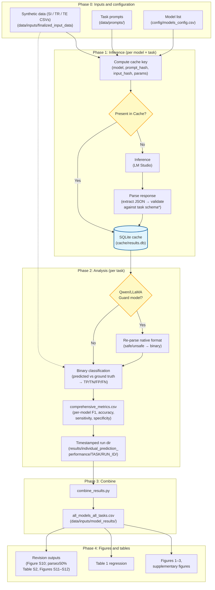

# Evaluating the relative impact of model scale, architecture, and fine-tuning on mental health–related safety classification tasks in open-source large language models

Code and analysis pipeline for **[Evaluating the effect of mental health fine-tuning relative to other model characteristics on LLM safety performance](https://www.medrxiv.org/content/10.64898/2026.01.02.25343289v1)** (medRxiv preprint).

## What this project does

Large language models are increasingly deployed in mental health contexts, but it is unclear whether mental health–specific fine-tuning improves safety-relevant classification beyond gains from model scale, architecture generation, or instruction tuning alone. We evaluated **127 open-source models** (Gemma, LLaMA, Qwen; ~270M–70B parameters) on three psychiatrist-reviewed synthetic classification tasks, comparing base models against models fine-tuned for: instruction following; medical literature; mental health tasks; detection of unsafe conversations.  

**Tasks:**
1. **Suicidal ideation detection** — classify statements for presence/absence of  suicidal ideation (450 items, 10 categories)
2. **Therapy request classification** — classify statements for presence/absence of explicit therapy requests (780 items, 12 categories)
3. **Therapy engagement detection** — classify statements for presence/absence of simulated therapy in multi-turn conversations (420 items, 13 categories)

## Data flow

All models are evaluated locally via **LM Studio**. Responses are cached in SQLite so figures can be regenerated without re-running inference. The pipeline has four phases:



**\*Schema validation note:** Llama Guard and Qwen Guard have been explicitly tuned to rigidly output plain text (`safe`/`unsafe`) regardless of the task prompt, so they fail the initial JSON validation. At analysis time (Phase 2), their native output is re-parsed from `raw_response` and mapped to each task's binary classification (`unsafe` → positive category). ShieldGemma outputs standard task JSON and passes validation normally. See `analysis/model_performance/data_loader.py`.

## Quick start

### Prerequisites

1. **Python 3.9+** with a virtual environment (always activate `.venv` before running anything)
2. **LM Studio** at `http://localhost:1234` (only needed to re-run experiments; not needed to regenerate figures from cache)

### Installation

```bash
git clone https://github.com/markkalinich/mental-health-finetune-analysis.git
cd mental-health-finetune-analysis

python3.9 -m venv .venv   # or: python -m venv .venv
source .venv/bin/activate  # Windows: .venv\Scripts\activate

pip install -r requirements.txt
```

Verify: `which python` should point inside `.venv/`.

### Run the paper pipeline

```bash
# Figures and tables using cached experiment results (typical)
python run_paper_pipeline.py --skip-experiments

# Full path including new experiments (requires LM Studio + models)
python run_paper_pipeline.py
```

**Outputs** (timestamped):

```
results/FINETUNE_PAPER_FIGURES/[YYYYMMDD_HHMMSS]/
├── figure_1/model_coverage_heatmap.png
├── figure_2/*.png
├── figure_3/delta_f1_finetune_facet.png
├── table_1/*.csv, *.html
├── supplementary_figures/*.png          # 9 family×task facet plots (Gemma, LLaMA, Qwen)
├── revision_figures/
│   ├── figure_s10_delta_parse_vs_delta_f1.png
│   ├── figure_s11_f1_vs_params_overall_trend_parse50pct_per_task.png
│   └── figure_s12_delta_f1_facet_parse50pct_per_task.png
├── revision_data/
│   ├── table_s2_multivariable_f1_bonferroni_parse50pct_per_task.csv
│   ├── table_s2_f1_bonferroni_paste_format.tsv
│   ├── parse50pct_per_task_cohort.json
│   └── …                          # P2 agreement, revised metadata table, facet stats
├── CLAIM_VERIFICATION.md
└── data/*.csv
```

**Canonical sources for revision sensitivity (parse≥50% per-task):** generated under `reviewer_2_experiments/results/parse50pct_per_task/` and copied into each pipeline run’s `revision_figures/` and `revision_data/`. See [`reviewer_2_experiments/REVIEWER_2_EXPERIMENTS.md`](reviewer_2_experiments/REVIEWER_2_EXPERIMENTS.md) for rebuttal claim evidence and audit.

Each run also writes a `PROVENANCE.json` recording the git commit, cache hash, input hashes, and CLI flags used.

## Figure and table guide

| Artifact | Description | Primary script(s) |
|----------|-------------|-------------------|
| **Figure 1** | Model coverage heatmap | `analysis/model_coverage_heatmap.py` |
| **Figure 2** | F1 vs parameter count | `analysis/comparative_analysis/compact_unified_facet_plot.py` |
| **Figure 3** | ΔF1 Pre/Post-Fine-Tuning | `analysis/combined_finetune_facet_plot.py` |
| **Table 1** | Multivariable Regression (F1 dependent variable) | `analysis/statistics/regression_analysis.py`, `create_*_tables.py` |
| **Supplementary (×9)** | Family × task facet plots (Gemma, LLaMA, Qwen) | `analysis/comparative_analysis/{gemma,llama,qwen}_version_facet_plot.py` |
| **Figure S10** | Δparse vs ΔF1 under fine-tuning (parse compliance sensitivity) | `analysis/revision/delta_parse_vs_delta_f1_scatter.py` |
| **Table S2** | Multivariable F1 regression on parse≥50% per-task cohort (N=91/84/99) | `reviewer_2_experiments/scripts/run_parse_filtered_outputs.py` |
| **Figure S11** | F1 vs parameters on parse≥50% cohort (parallel to Figure 2) | same |
| **Figure S12** | ΔF1 facets on parse≥50% cohort (parallel to Figure 3) | same |

## Repository structure

```
.
├── run_paper_pipeline.py                # Orchestrates experiments, figures, and tables
├── analysis/
│   ├── model_performance/               # data_loader.py, metrics_calculator.py, batch_results_analyzer.py
│   ├── comparative_analysis/            # Facet plots (Figures 2, supplementary)
│   ├── statistics/                      # Regression (Table 1)
│   ├── combine_results.py              # Merges per-task metrics → all_models_all_tasks.csv
│   └── combined_finetune_facet_plot.py  # Figure 3
├── config/
│   └── models_config.csv                # Model definitions, family/size/version, base-model mappings
├── orchestration/                       # Experiment runner, API client, data processing
├── cache/                               # result_cache.py; SQLite results.db lives here
├── data/
│   ├── inputs/finalized_input_data/     # Expert-reviewed benchmark CSVs (ground truth)
│   ├── inputs/model_results/            # all_models_all_tasks.csv (combined metrics)
│   └── prompts/                         # Task prompt text files
├── bash_scripts/                        # run_all_models.sh (inference orchestration)
├── utilities/                           # Cache QC, manuscript subset builder, model validator
├── reviewer_2_experiments/              # Rebuttal claims, parse≥50% sensitivity, provenance audits
└── results/                             # Pipeline outputs (timestamped run directories)
```

## Running individual components

```bash
# Figure 1
python analysis/model_coverage_heatmap.py

# Figure 2
python analysis/comparative_analysis/compact_unified_facet_plot.py --output-dir results/figure_2/

# Figure 3
python analysis/combined_finetune_facet_plot.py

# Table 1
python analysis/statistics/regression_analysis.py

# Revision sensitivity: Table S2 + Figures S11–S12 (parse≥50% per-task)
.venv/bin/python reviewer_2_experiments/scripts/run_parse_filtered_outputs.py --target all

# Figure S10 (Δparse vs ΔF1)
python analysis/revision/delta_parse_vs_delta_f1_scatter.py

# Verify rebuttal claims (artifact audit; see reviewer_2_experiments/REVIEWER_2_EXPERIMENTS.md)
reviewer_2_experiments/bash_scripts/audit_all_claims.sh --skip-live

# Run experiments for a subset of models
bash bash_scripts/run_all_models.sh --models "gemma:12b-it,llama3.1:8b" \
    data/inputs/finalized_input_data/SI_finalized_sentences.csv \
    data/prompts/system_suicide_detection_v2.txt \
    system_suicide_detection_v2

# Cache statistics
python -m cache.cache_manager stats
```

## Reproducibility

- Each pipeline run writes `PROVENANCE.json` with git commit, cache SHA-256, input hashes, and CLI flags.
- A frozen manuscript cache subset can be built with `utilities/build_manuscript_cache_subset.py`; run `utilities/cache_qc_report.py` against it to verify coverage.
- Reviewer-driven revision analyses live in [`reviewer_2_experiments/`](reviewer_2_experiments/) (parse≥50% Table S2 / Figures S11–S12, template provenance, guard re-parse evidence). Earlier exploratory outputs remain in `results/revision_experiments/`.
- Developer notes on venv setup, integrity checks, and git workflow: [`docs/DEVELOPMENT.md`](docs/DEVELOPMENT.md).

## Citation

If you use this code or data, please cite:

```bibtex
@article{kalinich2026mentalhealthfinetune,
  title={Evaluating the effect of mental health fine-tuning relative to other model characteristics on {LLM} safety performance},
  author={Kalinich, Mark and Luccarelli, James and {Santa Maria, Jr.}, John and Williams, Gwydion and Moss, Frank and Torous, John},
  journal={medRxiv},
  year={2026},
  doi={10.64898/2026.01.02.25343289},
  url={https://www.medrxiv.org/content/10.64898/2026.01.02.25343289v1}
}
```

## Acknowledgments

Claude Sonnet and Opus 4.5-6 via Cursor were used extensively to assist with code generation, refactoring, and documentation. All scientific claims, analysis choices, and responsibility for reproducibility remain with the authors.
