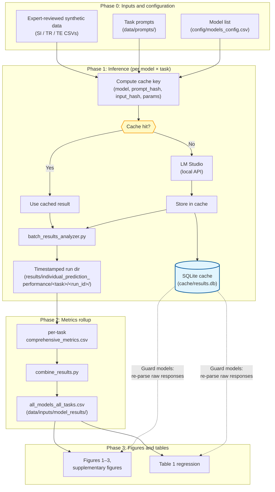

# Mental Health Fine-Tuning Analysis: LLM Safety Classification

Code and analysis pipeline for **[Evaluating the effect of mental health fine-tuning relative to other model characteristics on LLM safety performance](https://www.medrxiv.org/content/10.64898/2026.01.02.25343289v1)** (medRxiv preprint; manuscript text will be updated as revisions land).

## Background

Large language models (LLMs) are increasingly used in mental health applications, yet it remains unclear whether mental health–specific fine-tuning meaningfully improves safety-relevant performance beyond gains from model scale, architecture generation, or other training choices. This repository supports a large-scale empirical evaluation of **127 open-source models** across three psychiatrist-reviewed synthetic classification tasks, comparing base vs instruction-tuned models and contrasting general, medical, mental health–specific, and safety-oriented fine-tunes.

## Methods (pipeline summary)

- **Tasks:** (1) suicidal ideation detection, (2) therapy request classification, (3) therapy engagement detection in multi-turn conversations.  
- **Models:** Gemma, LLaMA, and Qwen families; parameter scales from ~270M to ~70B; configurations in `config/models_config.csv`.  
- **Inference:** Local evaluation via **LM Studio** (`http://localhost:1234`) when re-running experiments; responses and metadata are stored in a **SQLite** results cache (`cache/results.db`).  
- **Metrics:** Per-run outputs under `results/individual_prediction_performance/` are rolled into `comprehensive_metrics.csv` per task; `analysis/combine_results.py` merges the latest per-task runs into `data/inputs/model_results/all_models_all_tasks.csv`, which feeds figures and regression.  
- **Analysis:** F1-focused performance summaries, multivariable regression (Table 1), and paired fine-tune vs base comparisons (e.g. Figure 3). Some **safety-tuned (guard)** models require **task-specific re-parsing** of raw cached outputs (see `analysis/comparative_analysis/facet_plot_utils.py` and revision notes below).

## Data flow

High-level flow from inputs through inference, metrics, and publication artifacts (mirrors the diagram style used in the [regulatory_simulations](https://github.com/markkalinich/regulatory_simulations) reproducibility package).

**Rendering:** Some Markdown previews (including Cursor’s) do not render Mermaid as well as [GitHub’s viewer](https://github.com/markkalinich/mental-health-finetune-analysis/blob/main/README.md). Newlines inside nodes use `\n`, which Mermaid treats as line breaks in most renderers.



**Note:** The dashed edges reflect that guard-model corrections **read** cached raw responses in analysis code paths (not only at `combine_results` time). Exact behavior is documented under `results/revision_experiments/`.

**Direction:** The intended end state is inference → raw cache → **one pinned ground-truth artifact** (including safety/guard transformations applied once), then figures and tables. The current rollup still mixes sources; see [`docs/DEVELOPMENT.md`](docs/DEVELOPMENT.md).

## Quick start

### Prerequisites

1. **Python 3.9+** with a virtual environment (see [`docs/DEVELOPMENT.md`](docs/DEVELOPMENT.md): **always activate `.venv` before running Python**—agents and scripts should not use a random system interpreter).  
2. **LM Studio** at `http://localhost:1234` (only if re-running experiments, not for figures-from-cache workflows)

### Installation

```bash
git clone https://github.com/markkalinich/mental-health-finetune-analysis.git
cd mental-health-finetune-analysis

python3.9 -m venv .venv   # or: python -m venv .venv
source .venv/bin/activate  # Windows: .venv\Scripts\activate

pip install -r requirements.txt
```

Verify: `which python` should point inside `.venv/`.

### Run the paper pipeline

```bash
# Figures and tables using cached experiment results (typical)
python run_paper_pipeline.py --skip-experiments

# Full path including new experiments (requires LM Studio + models)
python run_paper_pipeline.py
```

**Outputs** (timestamped):

```
results/FINETUNE_PAPER_FIGURES/[YYYYMMDD_HHMMSS]/
├── figure_1/model_coverage_heatmap.png
├── figure_2/*.png
├── figure_3/delta_f1_finetune_facet.png
├── table_1/*.csv, *.html
├── supplementary_figures/*.png
└── data/*.csv
```

## Figure and table guide

| Artifact | Description | Primary script(s) |
|----------|-------------|-------------------|
| **Figure 1** | Model coverage heatmap | `analysis/model_coverage_heatmap.py` |
| **Figure 2** | F1 vs parameters (trends) | `analysis/comparative_analysis/compact_unified_facet_plot.py` |
| **Figure 3** | Δ fine-tune F1 (paired base vs fine-tune) | `analysis/combined_finetune_facet_plot.py` |
| **Table 1** | Regression with Bonferroni correction | `analysis/statistics/regression_analysis.py`, `create_*_tables.py` |
| **Supplementary** | Family × task facet plots (9) | `analysis/comparative_analysis/{gemma,llama,qwen}_version_facet_plot.py` |

## Repository structure (abbreviated)

```
.
├── run_paper_pipeline.py          # Orchestrates experiments (optional), figures, table
├── analysis/                      # Figures, statistics, model performance
├── config/models_config.csv       # Model definitions and base-model mappings
├── orchestration/                 # run_experiment.py, API client, data loading
├── cache/                         # result_cache.py; SQLite results.db
├── data/inputs/finalized_input_data/   # Expert-reviewed benchmarks
├── data/prompts/                  # Task prompts
├── data/inputs/model_results/     # all_models_all_tasks.csv (combined metrics)
├── bash_scripts/                  # run_all_models.sh, etc.
└── results/                       # Pipeline outputs, revision experiment notes
```

## Datasets

| Dataset | Items | Categories | Notes |
|---------|------:|------------|--------|
| Suicidal ideation | 450 | 10 | Expert-reviewed synthetic statements |
| Therapy request | 780 | 12 | Expert-reviewed synthetic statements |
| Therapy engagement | 420 | 13 | Expert-reviewed synthetic conversations |

## Reproducibility and revision work

- **Reviewer-driven analyses** (parse success, ΔF1, guard-cache behavior): see [`results/revision_experiments/README_REVISIONS.md`](results/revision_experiments/README_REVISIONS.md).  
- **Session notes** on guard parsing fixes and data integrity checks: [`results/revision_experiments/GUARD_FIX_SESSION_SUMMARY.md`](results/revision_experiments/GUARD_FIX_SESSION_SUMMARY.md).  

A **manuscript-only results cache** (single source of truth aligned with the exact inputs used for the paper) is planned to reduce ambiguity between “what’s on disk” and “what the paper used”; subsequent steps will walk through transformations explicitly. A concrete **provenance plan** (commit + cache + input hashes → outputs; machine-written `PROVENANCE.json` per run) is in [`docs/PROVENANCE_PLAN.md`](docs/PROVENANCE_PLAN.md). The regulatory paper’s **frozen subset cache** ([`regulatory_paper_cache_v3`](https://github.com/markkalinich/regulatory_simulations/tree/main/regulatory_paper_cache_v3) — `results.db` + `MD5SUM.txt`) and the separate “filter at analysis time” flow are both described in [`docs/REGULATORY_CACHE_PATTERN.md`](docs/REGULATORY_CACHE_PATTERN.md). Narrow **provenance** learnings from the multiturn project are in [`docs/LLM_MULTITURN_LEARNINGS.md`](docs/LLM_MULTITURN_LEARNINGS.md).

**Integrity:** When comparing or pinning artifacts, use **checksums** (e.g. `sha256sum`), not file size or informal “looks the same.” See [`docs/DEVELOPMENT.md`](docs/DEVELOPMENT.md).

**Refactor:** Multiple sources of truth in the current design are a known limitation; structural changes should be planned against pinned data and tests—notes in [`docs/DEVELOPMENT.md`](docs/DEVELOPMENT.md).

**Git:** To iterate privately before updating the public repo, see [`docs/DEVELOPMENT.md`](docs/DEVELOPMENT.md#private-iteration-vs-public-github).

**Automation / agents:** See root [`AGENTS.md`](AGENTS.md) and [`docs/DEVELOPMENT.md`](docs/DEVELOPMENT.md) for venv and integrity checks.

## Running individual components

```bash
# Figure 1
python analysis/model_coverage_heatmap.py

# Figure 2
python analysis/comparative_analysis/compact_unified_facet_plot.py --output-dir results/figure_2/

# Figure 3
python analysis/combined_finetune_facet_plot.py

# Table 1
python analysis/statistics/regression_analysis.py
```

### Experiments for a subset of models

```bash
bash bash_scripts/run_all_models.sh --models "gemma:12b-it,llama3.1:8b" \
    data/inputs/finalized_input_data/SI_finalized_sentences.csv \
    data/prompts/system_suicide_detection_v2.txt \
    system_suicide_detection_v2
```

### Cache utilities

```bash
python -m cache.cache_manager stats
```

**Manuscript subset + QC:** Build a frozen SQLite subset with `utilities/build_manuscript_cache_subset.py`.

Run **`utilities/cache_qc_report.py`** against `manuscript_paper_cache/results.db` (registry triple + optional `model_cache_crosswalk_approved.csv`) to summarize coverage and integrity — see [`manuscript_paper_cache/README.md`](manuscript_paper_cache/README.md).

## Citation

If you use this code or data, please cite:

```bibtex
@article{kalinich2026mentalhealthfinetune,
  title={Evaluating the effect of mental health fine-tuning relative to other model characteristics on {LLM} safety performance},
  author={Kalinich, Mark and Luccarelli, James and {Santa Maria, Jr.}, John and Williams, Gwydion and Moss, Frank and Torous, John},
  journal={medRxiv},
  year={2026},
  doi={10.64898/2026.01.02.25343289},
  url={https://www.medrxiv.org/content/10.64898/2026.01.02.25343289v1}
}
```

## Acknowledgments

Claude Sonnet and Opus 4.5 via Cursor were used extensively to assist with code generation, refactoring, and documentation. All scientific claims, analysis choices, and responsibility for reproducibility remain with the authors.
